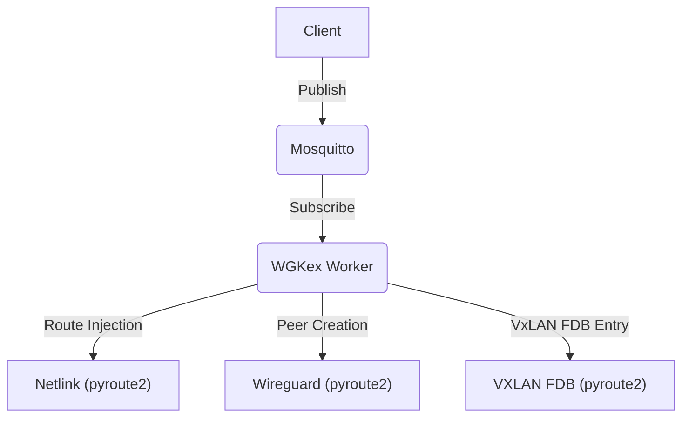
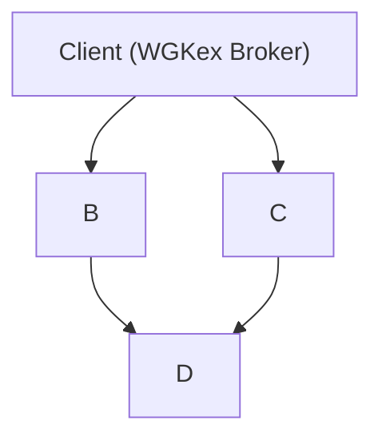

```mermaid
graph TD;
    A["Client"] -->|Publish| B("Mosquitto");
    B -->|Subscribe| C("WGKex Worker");
    C -->|Route Injection| D["Netlink (pyroute2)"];
    C -->|Peer Creation| E["Wireguard (pyroute2)"];
    C -->|VxLAN FDB Entry| F["VXLAN FDB (pyroute2)"];
```

```mermaid
graph TD;
    A["Client (WGKex Broker)"] -->B;
    A-->C;
    B-->D;
    C-->D;
```
